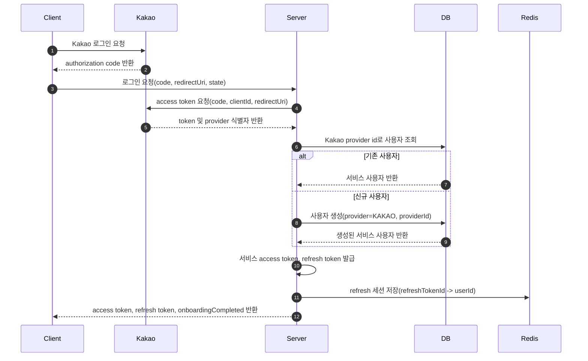
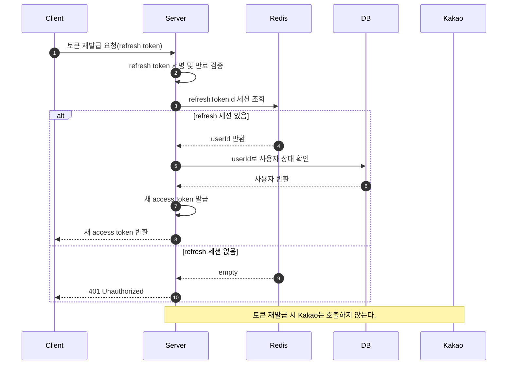
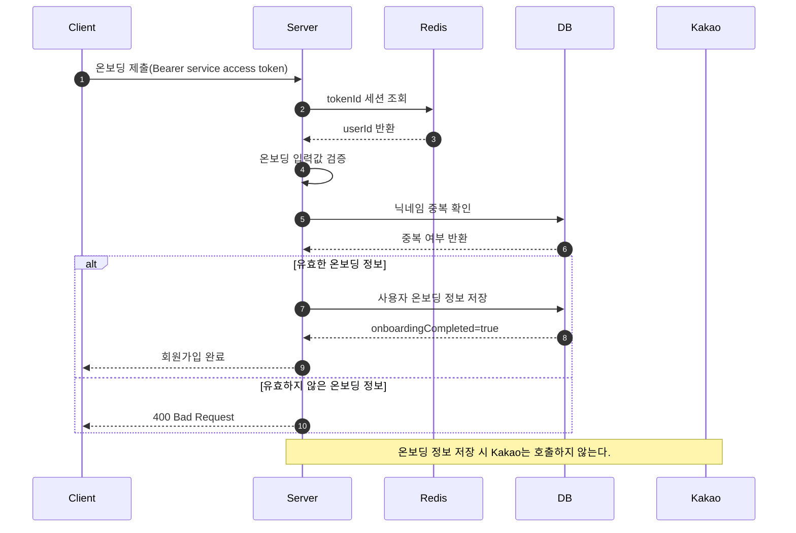
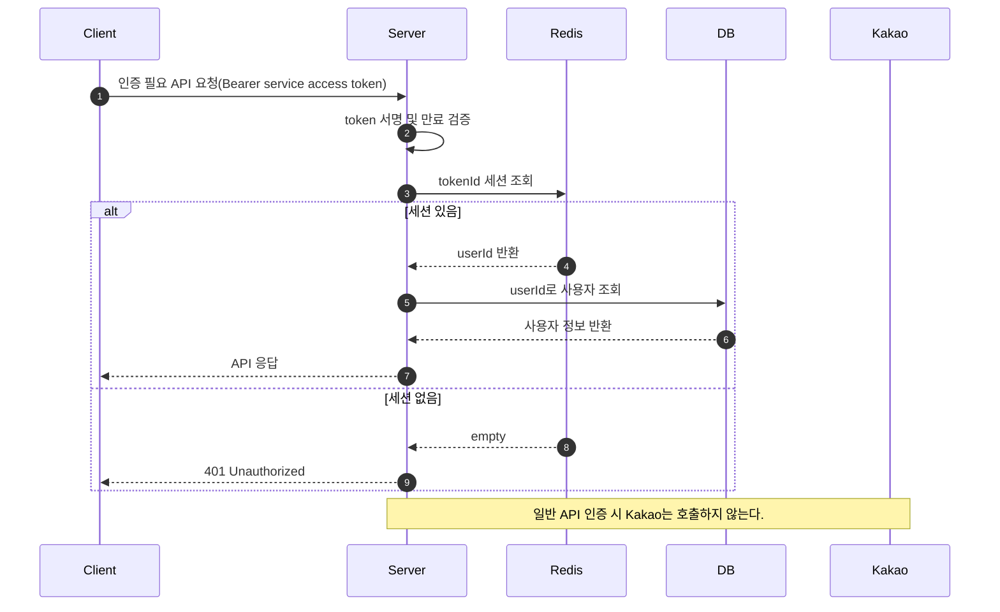
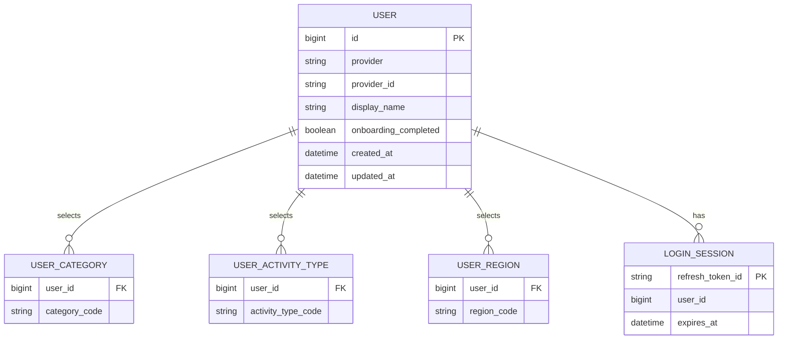
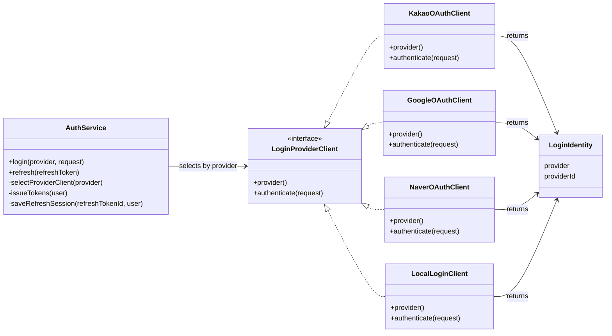

# ADR-001 Kakao 로그인 로직 설계

- Status: Proposed
- Date: 2026-06-01
- Scope: Auth / Kakao OAuth Login
- Assumption: 아직 개발을 시작하지 않은 설계 단계

## Context

서비스는 Kakao OAuth를 사용해 사용자를 인증하고, 서비스 계정과 연결할 최소 식별자만 확인한다. Client는 Kakao에서 authorization code를 받은 뒤 Server에 전달하고, Server는 Kakao와 통신해 해당 code가 유효한지 검증한다.

닉네임, 관심 카테고리, 활동 유형, 지역 같은 사용자 정보는 OAuth 응답으로 받지 않는다. 필요한 사용자 정보는 서비스 자체 회원가입 온보딩에서 별도로 입력받고 DB에 저장한다.

서비스 내부 인증은 Kakao access token을 그대로 사용하지 않는다. Server가 자체 access token과 refresh token을 발급하고, Redis에는 refresh token 기반 로그인 세션을 저장한다. DB에는 서비스 계정 정보와 Kakao 계정 연결 정보가 저장된다.

## Decision

Kakao 로그인은 다음 다섯 구성요소만 기준으로 설계한다.

| Component | Responsibility |
| --- | --- |
| Kakao | OAuth 인증, authorization code 발급, token 발급, 계정 연결에 필요한 최소 식별자 제공 |
| Client | Kakao 로그인 시작, authorization code 수신, Server 로그인 API 호출, 서비스 access token과 refresh token 저장 |
| Server | code 검증, Kakao token 교환, provider 식별자 확인, 사용자 가입/조회, 서비스 token 발급 및 재발급 |
| Redis | refresh token 세션 저장, 재발급 및 로그아웃 검증 기준 제공 |
| DB | 서비스 사용자 계정 저장, Kakao provider id와 내부 user id 매핑, 온보딩 정보 저장 |

## Login Sequence

## Token Refresh Sequence

## Signup Onboarding Sequence

## Authentication Sequence

## Data Model

## Server Login Policy

- Server는 Client가 전달한 `code`가 없으면 로그인 요청을 거절한다.
- Server는 Kakao token API를 호출해 code를 token으로 교환한다.
- Server는 token 응답 또는 검증 가능한 token payload에서 계정 연결용 provider id를 확인한다.
- provider id가 없거나 검증할 수 없으면 로그인에 실패한다.
- Server는 `provider = KAKAO`, `providerId = Kakao provider id` 조합으로 DB에서 사용자를 찾는다.
- 사용자가 없으면 신규 사용자로 생성한다.
- 신규 사용자에게 필요한 닉네임, 관심 카테고리, 활동 유형, 지역은 OAuth가 아니라 서비스 온보딩에서 받는다.
- Server는 서비스용 access token과 refresh token을 발급하고 Redis에 refresh 세션을 저장한다.
- Client는 일반 API 요청에는 access token을 사용하고, access token이 만료되면 refresh token으로 재발급을 요청한다.
- Client는 이후 요청에서 Kakao token이 아니라 Server가 발급한 service token을 사용한다.

## Token Policy

- Access token은 API 인증에 사용한다.
- Access token은 짧은 TTL을 가진다.
- Refresh token은 access token 재발급에만 사용한다.
- Refresh token은 access token보다 긴 TTL을 가진다.
- Redis에는 refresh token id와 user id 매핑을 저장한다.
- 로그아웃 시 Redis의 refresh 세션을 삭제한다.
- Refresh token이 만료되었거나 Redis에 세션이 없으면 다시 로그인해야 한다.
- 재발급 시 refresh token rotation 적용 여부는 별도 결정한다.

## Onboarding Policy

- 온보딩은 로그인 성공 후 `onboardingCompleted=false`인 사용자에게 진행한다.
- 닉네임은 필수이며 중복 확인을 통과해야 한다.
- 관심 카테고리는 필수이며 최소 1개, 최대 5개까지 선택할 수 있다.
- 활동 유형은 선택이며 중복 선택을 허용한다.
- 지역은 선택이며 최대 5개까지 선택할 수 있다.
- 온보딩 저장이 완료되면 `onboardingCompleted=true`로 변경한다.
- 온보딩 정보는 OAuth provider에서 조회하지 않고 Client가 제출한 값을 기준으로 저장한다.

## Server Abstraction Structure

Server 내부는 로그인 방식별 차이를 로그인 서비스에서 직접 처리하지 않는다. `AuthService`는 provider 이름으로 알맞은 `LoginProviderClient`를 선택하고, 선택된 client는 Kakao, Google, Naver 또는 향후 자체 로그인 방식과 통신한 뒤 공통 `LoginIdentity`를 반환한다.

초기 설계에서는 interface만 둔다. OAuth provider 간 중복 로직은 실제 구현 중 반복이 확인되면 별도 helper 또는 abstract class로 분리한다.

### Abstraction Rules

- `AuthService`는 Kakao, Google, Naver의 API endpoint와 응답 구조를 알지 않는다.
- `LoginProviderClient`는 OAuth와 자체 로그인을 모두 포함할 수 있는 로그인 어댑터의 공통 계약이다.
- `KakaoOAuthClient`, `GoogleOAuthClient`, `NaverOAuthClient`는 provider별 인증 및 식별자 추출을 담당한다.
- `LocalLoginClient`는 향후 자체 로그인 방식이 생길 때 같은 계약으로 추가한다.
- `LoginIdentity`에는 계정 연결에 필요한 최소 식별자만 담고, 닉네임/이메일/프로필 이미지는 담지 않는다.
- 새 로그인 방식이 추가되어도 `AuthService`의 로그인 흐름은 바뀌지 않고 `LoginProviderClient` 구현체만 추가한다.

## Consequences

### Positive

- Client는 Kakao 로그인과 서비스 인증을 명확히 분리할 수 있다.
- Server가 사용자 식별, 가입, 토큰 발급 정책을 통제한다.
- Redis refresh 세션을 삭제하면 access token 재발급을 차단할 수 있다.
- DB에는 Kakao provider id와 내부 user id의 매핑이 남으므로 재로그인 시 같은 사용자로 식별할 수 있다.
- 사용자 프로필 수집 정책이 OAuth provider 동의 항목에 종속되지 않는다.

### Trade-offs

- Server는 Kakao OAuth API 연동 실패를 처리해야 한다.
- Redis 장애가 로그인 유지와 인증 요청에 영향을 줄 수 있다.
- DB 사용자 생성 정책을 먼저 정해야 한다.
- OAuth에서 사용자 정보를 받지 않으므로 회원가입 온보딩 API가 필요하다.
- Refresh token 저장, 만료, rotation, 탈취 대응 정책을 정해야 한다.
- `state` 검증을 Server에서 할지 Client에서 할지 별도 결정이 필요하다.

## Failure Mapping

| Case | Result |
| --- | --- |
| Client가 code 없이 로그인 요청 | 400 Bad Request |
| Kakao token 요청 실패 | 401 Unauthorized |
| Kakao provider id 확인 실패 | 401 Unauthorized |
| DB 사용자 조회/생성 실패 | 500 Internal Server Error |
| 닉네임 중복 | 409 Conflict |
| 온보딩 필수값 누락 또는 선택 개수 초과 | 400 Bad Request |
| 서비스 token 발급 실패 | 500 Internal Server Error |
| Redis refresh 세션 저장 실패 | 500 Internal Server Error |
| refresh token 만료 또는 세션 없음 | 401 Unauthorized |
| 인증 요청에서 Redis 세션 없음 | 401 Unauthorized |

## Open Questions

- Kakao token 응답에서 provider id를 어떤 방식으로 검증할 것인가?
- 활동 유형과 지역을 추천/매칭에 즉시 사용할 것인가?
- 관심 카테고리, 활동 유형, 지역 코드는 서버 고정 enum으로 관리할 것인가, DB 코드 테이블로 관리할 것인가?
- refresh token rotation을 적용할 것인가?
- access token과 refresh token TTL을 각각 얼마로 둘 것인가?
- logout 시 Redis refresh 세션만 삭제할 것인가, DB에 로그인 이력을 남길 것인가?
- OAuth `state`는 Server가 발급하고 검증할 것인가?
